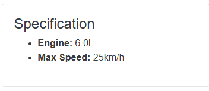

# BR-001: Incorrect maximum speed for Lamborghini Diablo

**Status:** New  
**Severity:** Medium  
**Priority:** Medium  
**Environment:** Windows 11, Google Chrome, desktop PC

## Preconditions
The user is logged in to Buggy Cars Rating.

## Steps to reproduce
1. Open the Lamborghini Diablo vehicle page.
2. Scroll to the `Specification` section.
3. Check the `Max Speed` value.

## Expected result
The maximum speed should match the Lamborghini Diablo specification, approximately `325 km/h`.

## Actual result
The application displays the maximum speed as `25 km/h`.

## Impact
Users receive incorrect vehicle information, which reduces trust in the catalog data.

## Evidence

