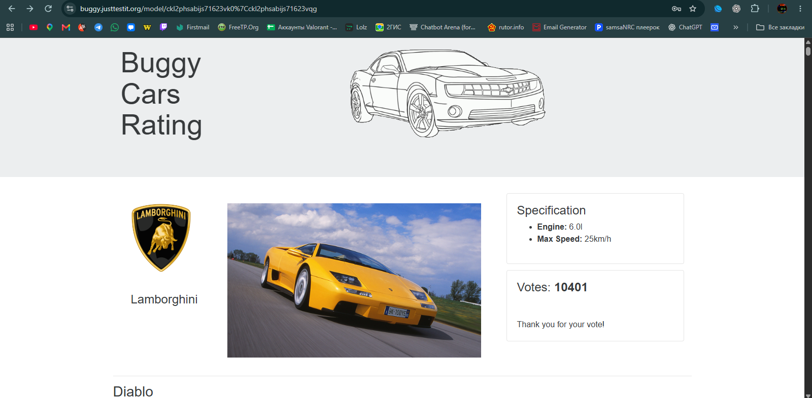
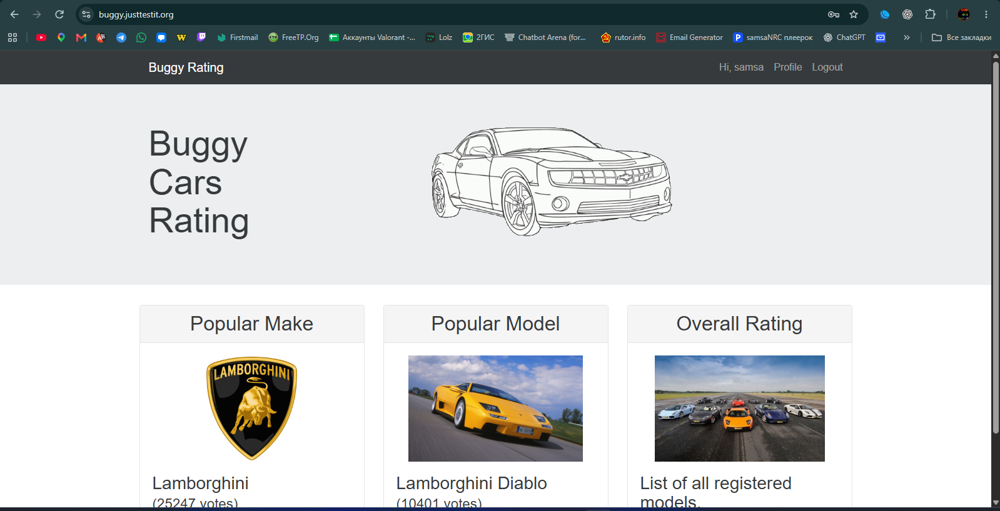

# BR-002: Clicking a car image redirects the user to the home page

**Status:** New  
**Severity:** Medium  
**Priority:** Medium  
**Environment:** Windows 11, Google Chrome, desktop PC

## Preconditions
The user is logged in to Buggy Cars Rating and has opened the Lamborghini Diablo vehicle page.

## Steps to reproduce
1. Open the Lamborghini Diablo vehicle page.
2. Click the main car image.

## Expected result
The application should keep the user in the current vehicle context: open the image, remain on the vehicle page, or make the image non-interactive.

## Actual result
The user is redirected to the main page of the application.

## Impact
The user loses the current vehicle page and must navigate to the model again.

## Evidence

### Before clicking the car image

### After clicking the car image

